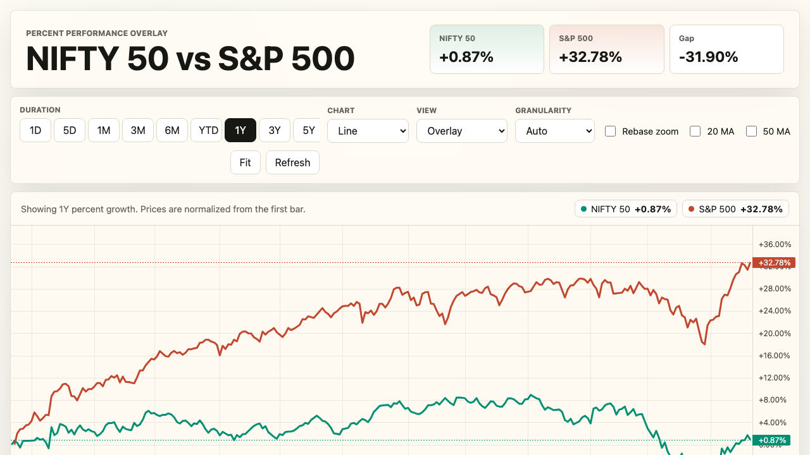

# NIFTY 50 / S&P 500 Evidence Desk

**[Live Demo →](https://nifty-spx-evidence-desk.vercel.app)** | No install. No signup. Open in browser.

[](https://nifty-spx-evidence-desk.vercel.app)

The NIFTY 50 / S&P 500 Evidence Desk is an interactive data-science portfolio project that compares Indian and U.S. equity-market behavior through live percent-growth charts, lead-lag studies, regression diagnostics, macro context, and risk analytics. It is built to answer a practical question with evidence instead of intuition: when the S&P 500 moves, how much of that signal appears in NIFTY, under which horizons, and with what caveats? What makes the project different is the combination of polished market-terminal UI, transparent statistical methodology, and a zero-build vanilla JavaScript architecture that runs locally with a single Node command.




Unit tests cover the five core statistical functions (dailyReturns, rollingPearson, hitRate, olsRegression, grangerTest). UI behavior is validated manually.

## Features

### Live Overlay

Real-time visual comparison for NIFTY 50 and the S&P 500.

- Percent-growth normalization so both indices start from a shared 0% baseline.
- Session-aligned mode for comparing each market from its own open.
- Exact-time mode for preserving the real India/U.S. trading-session gap.
- Line, candle, and baseline chart rendering with TradingView Lightweight Charts.
- Overlay, difference, and split views for comparing direction, spread, and individual behavior.
- 20-session and 50-session moving-average overlays for trend context.
- Rebase-zoom behavior that recalculates visible performance from the current chart window.
- Session scrub replay for walking through a trading day as a narrated evidence trail.

### Story Deck

Ten case-study cards that translate the statistical work into readable market stories.

- Each card follows a consistent data-science structure: problem, feature engineering, model specification, result, and limitation.
- Includes studies such as **S&P Follow-Through as Directional Feature**, **INR Depreciation as Confounder**, and **India Catch-Up as Regime Shift**.
- Uses OLS framing to explain beta, fit quality, residual behavior, and directional usefulness.
- Keeps the language intentionally disciplined: association is treated as evidence to inspect, not as a trading signal by default.

### Deep Dive

The statistical cockpit for validating whether the relationship is stable, useful, and conditional.

- Rolling Pearson correlation with Fisher confidence bands.
- Granger causality test for whether lagged S&P returns add explanatory power for NIFTY returns.
- OLS regression with beta, R^2, fitted values, residuals, and hit-rate context.
- Lag sweep analysis across same-day, prior-close, and two-session-back alignments.
- Weekly and monthly horizon testing to separate daily noise from broader co-movement.
- Risk, volatility, Sharpe, Sortino, and drawdown cockpit for comparing return quality.
- Divergence radar for spotting recent sessions where the indices stopped moving together.

### Macro Notebook

Macro lenses that explain when the NIFTY/S&P relationship may be distorted by outside forces.

- USD/INR lens for currency-driven interpretation of foreign-market moves.
- Brent crude lens for energy-price pressure and India import-cost context.
- Nasdaq vs S&P tech-breadth lens for separating broad U.S. risk appetite from tech concentration.
- Forward scenario builder for combining S&P, currency, crude, and breadth assumptions.
- Macro context cards that frame possible confounders without overstating causality.

## Statistical Methodology

The project keeps the statistical layer small and inspectable. Core pure functions live in `modules/stats.js`; higher-level study views compose those primitives with session-aware market alignment in the app pipeline.

| Method | Purpose |
| --- | --- |
| `dailyReturns()` | Converts OHLC bars into clean close-to-close return series. |
| `rollingPearson()` | Computes rolling correlation and Fisher z confidence bands over aligned return windows. |
| `olsRegression()` | Fits `y = alpha + beta * x` and reports slope, intercept, and R^2 for market sensitivity analysis. |
| `grangerTest()` | Runs an F-statistic Granger causality test to check whether lagged S&P returns add explanatory power for NIFTY returns. |
| `hitRate()` / Wilson interval | Measures directional agreement and attaches a Wilson score confidence interval to the hit rate. |
| Lagged alignment analysis | Compares same-day, prior-close, two-session-back, weekly, and monthly horizons using session-aware return pairing. |
| Rolling risk statistics | Summarizes rolling mean, volatility, Sharpe, Sortino, and max drawdown for risk-adjusted interpretation. |

## Architecture

```text
.
|-- server.js
|-- index.html
|-- app.js
|-- styles.css
|-- lightweight-charts.standalone.production.js
|-- modules
|   |-- data.js
|   |-- stats.js
|   `-- stats.test.js
|-- nifty-spx-chart.png
`-- ss-main-v2.png
```

- `server.js` - Node.js HTTP server, static-file server, and Yahoo Finance chart proxy with input validation and path traversal protection.
- `index.html` - App shell and page markup for the Live Overlay, Story Deck, Deep Dive, and Macro Notebook.
- `app.js` - 3,017-line browser orchestrator for routing, chart rendering, study generation, state management, replay controls, and UI updates.
- `styles.css` - 2,818-line dark theme using CSS custom properties, responsive grids, chart layouts, and dashboard polish.
- `modules/data.js` - Yahoo payload parsing, market metadata, OHLC normalization, range filtering, and exchange-session helpers.
- `modules/stats.js` - 549-line pure statistical toolkit with JSDoc-documented return, correlation, regression, hit-rate, and Granger-test functions.
- `modules/stats.test.js` - Node test coverage for the core statistical functions.
- `lightweight-charts.standalone.production.js` - Vendored TradingView Lightweight Charts runtime.
- `nifty-spx-chart.png` / `ss-main-v2.png` - Portfolio screenshots for GitHub and project presentation.

## Getting Started

```bash
git clone https://github.com/AbhayJuloori/nifty-spx-evidence-desk.git
cd nifty-spx-evidence-desk
node server.js
```

Open:

```text
http://localhost:4173
```

There is no build step and no framework runtime. The local server is required because it serves the static app, the vendored chart library, and the Yahoo Finance proxy at `/api/chart`.

To run the statistical unit tests (Node.js ≥ 18, no dependencies required):

```bash
npm test
```

## Project Structure

| Path | Role |
| --- | --- |
| `server.js` | Local HTTP server and validated Yahoo Finance proxy for `^NSEI`, `^GSPC`, `INR=X`, `BZ=F`, and `^NDX`. |
| `index.html` | Semantic page structure and controls for all four app sections. |
| `app.js` | Main ES-module application controller for data fetching, routing, chart state, studies, and rendering. |
| `styles.css` | Responsive dark UI system with CSS variables, chart panels, decks, tables, and macro layouts. |
| `modules/data.js` | Market symbol configuration, Yahoo chart parsing, session windows, and range normalization. |
| `modules/stats.js` | Pure statistical functions used by the evidence views. |
| `modules/stats.test.js` | Unit tests for returns, correlation, hit rate, OLS, and Granger test behavior. |
| `lightweight-charts.standalone.production.js` | Local charting dependency so the app can run without a bundler. |
| `nifty-spx-chart.png` | README screenshot. |
| `ss-main-v2.png` | Alternate full-app screenshot. |

## Design Decisions

### Vanilla JavaScript, No Build Step

The project uses ES modules directly in the browser instead of React, Vite, or a bundled framework. That keeps the app portable, inspectable, and easy to run from a clean checkout: start `node server.js`, open the browser, and the full research desk is live. For a portfolio project focused on evidence design rather than framework mechanics, the simplicity is a feature.

### Yahoo Finance Proxy

Yahoo Finance chart endpoints are called through the local Node server because browser-side requests run into CORS restrictions. The proxy keeps the surface area narrow: it validates symbol keys, ranges, intervals, and explicit periods before using `curl` to request chart data.

### Percent-Growth Normalization

NIFTY and the S&P 500 have different index levels, currencies, trading hours, and volatility profiles. Rebased percent growth makes the comparison apples-to-apples: each series starts at 0%, and the viewer compares relative movement rather than raw index points.

### Session-Aware Framing

India and the U.S. do not trade at the same time. The app supports both session-aligned views and exact-time views because each answers a different question: whether sessions behave similarly from their opens, and how the real-world clock gap affects interpretation.

## What I Learned / Built This To Explore

I built this project to practice turning a market question into an evidence workflow: define the alignment problem, normalize the data, test multiple horizons, inspect residuals, and make the uncertainty visible. The main lesson is that market relationships are rarely a single number. A correlation can be high in one window and weak in another; a beta can look useful while residuals still carry the real story; a directional hit rate needs confidence bounds before it becomes meaningful.

The project is intentionally framed as association, not causation. Granger tests, OLS regression, lag sweeps, and macro context can point to useful structure, but they do not prove that one market mechanically drives the other. That discipline is the point: the Evidence Desk is designed to make a claim stronger when the data supports it and narrower when it does not.

## License

MIT
